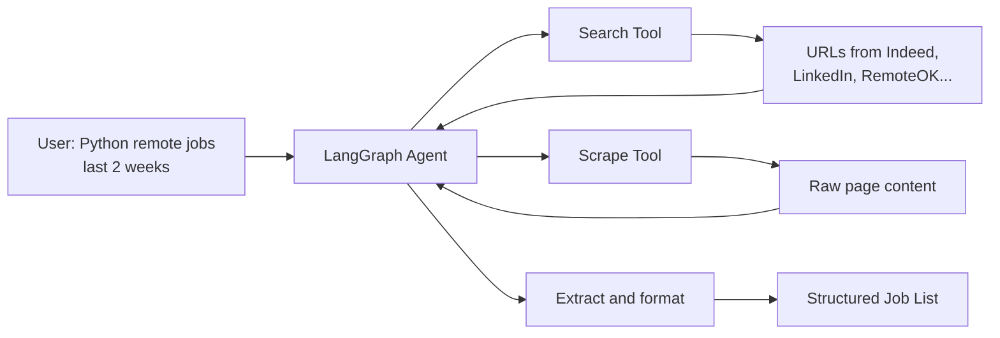

# Job Search AI Agent - Learning Plan

## What You Will Build

An agent you can ask:

> "Find me mid-level Python remote jobs posted in the last 2 weeks"

And it returns:

```
1. Senior Python Developer - Acme Corp
   Location: Remote (US)
   Posted: 5 days ago
   URL: https://...

2. Python Backend Engineer - StartupXYZ
   ...
```

---

## Architecture



---

## Phase 1: Environment and First LLM Call

**Goal**: Gemini responds through LangChain

**Steps**:

1. Initialize uv project, install `langchain`, `langchain-google-genai`, `python-dotenv`
2. Create `.env` with `GOOGLE_API_KEY`
3. Write a function: question in, answer out

**Test**: Ask "What makes a good Python developer job posting?"

---

## Phase 2: Search Tool

**Goal**: LLM can search the web for job listings

**Steps**:

1. Install `duckduckgo-search`
2. Create `search_jobs` tool that searches DuckDuckGo
3. Bind tool to LLM, let it decide when to search

**Test**: "Search for Python remote jobs" - LLM should call the search tool

---

## Phase 3: LangGraph State Machine

**Goal**: Agent can loop (search, think, search more if needed)

**Steps**:

1. Install `langgraph`
2. Define `AgentState` (messages, maybe found_jobs list)
3. Create graph: agent node with conditional edge (use tool or finish)
4. Agent can now do multiple searches if needed

**Test**: Complex query that might need multiple searches

---

## Phase 4: Scrape Tool with Crawl4AI

**Goal**: Agent can read actual job posting pages

**Steps**:

1. Install `crawl4ai`
2. Create `scrape_page` tool - URL in, markdown content out
3. Add to agent's toolset
4. Agent can now: search -> get URLs -> scrape pages -> extract info

**Test**: "What jobs are on RemoteOK for Python developers?"

---

## Phase 5: Structured Output and Polish

**Goal**: Clean, usable job listings

**Steps**:

1. Define a `JobListing` structure (title, company, location, remote, posted_date, url, salary_range)
2. Improve system prompt to be a "job search specialist"
3. Add error handling (site blocks scraping, etc.)
4. Format output nicely

**Test**: Full end-to-end "Python mid remote jobs last 2 weeks"

---

## File Structure

```
scrape-ai-agent/
├── .env                    # GOOGLE_API_KEY
├── pyproject.toml          # Dependencies
├── main.py                 # Entry point - run the agent
└── src/
    ├── agent.py            # LangGraph job search agent
    ├── state.py            # AgentState definition
    ├── tools/
    │   ├── search.py       # DuckDuckGo job search
    │   └── scrape.py       # Crawl4AI scraper
    └── prompts.py          # Job search specialist prompt
```

---

## Key Differences from Generic Agent

| Aspect | Generic | Job Search Specialized |

|--------|---------|----------------------|

| System Prompt | "You are a helpful assistant" | "You are a job search specialist. Extract: title, company, location, remote status, posted date, salary if available" |

| Search Queries | Whatever user asks | Optimized for job boards: "site:linkedin.com/jobs OR site:indeed.com Python remote" |

| Output | Free text | Structured job listings |

| Validation | None | Check if results look like jobs |

---

## Costs

| Service | Cost |

|---------|------|

| Gemini 2.0 Flash | Free tier |

| DuckDuckGo | Free |

| Crawl4AI | Free |

| LangSmith (optional) | Free tier |

**Total: $0**

---

## Time Estimate

| Phase | Time |

|-------|------|

| Phase 1: Setup + LLM | 1-2 hours |

| Phase 2: Search Tool | 2-3 hours |

| Phase 3: LangGraph | 3-4 hours |

| Phase 4: Scraping | 2-3 hours |

| Phase 5: Polish | 2-3 hours |

**Total: ~12-15 hours** (can be done in a week of evening sessions)

---

## Note on Job Site Scraping

Some sites (especially LinkedIn) have anti-scraping measures. The agent will:

- Try to scrape
- If blocked, fall back to search result snippets
- Prioritize scrape-friendly sites when possible

This is realistic - you will learn to handle real-world limitations.